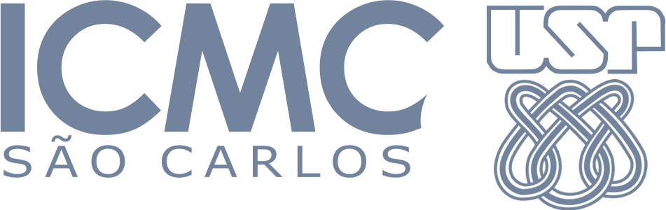
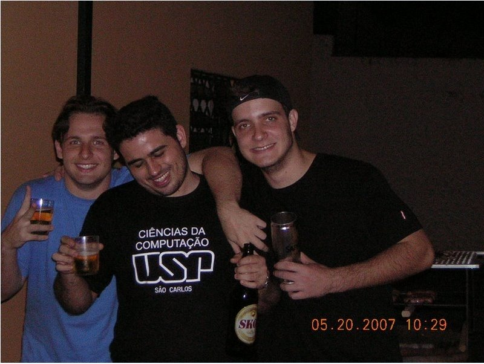

# BBF - Bira Bachelor Files



**Bira Bachelor Files** é o resultado de alguma organização, vários infortúnios, muita dedicação, e acima de tudo, anos inesquecíveis durante minha graduação no Instituto de Ciências Matemáticas e de Computação da USP, em São Carlos.

Eu tive o costume desde muito cedo de manter um backup organizado por disciplina de todo o material oficial / pesquisado / indicado que eu julgasse interessante para cada uma das matérias que julguei importantes durante meu curso. 

A título de curiosidade, durante a edição de *"Teoria da Computação e Linguagens Formais"* no meu ano, eu vasculhei o antigo sistema CoTeia-Wiki do ICMC atrás de material dos anos anteriores, e também mantive no meu backup as provas com as soluções, bem como os trabalhos práticos, algo se mostrou muito útil para aqueles amigos que eventualmente tiveram problemas e retornaram à disciplina no ano seguinte, rs 😂😂😂

No diretório `courses` você poderá encontrar muito material de referência, incluindo slides de aula, trabalhos (descrição e resolução!), bastante código ~~mal-feito~~ de estudante, eventuais provas + resolução e toda a sorte de coisas aleatórias relacionadas a cada uma das principais disciplinas do curso de Ciência da Computação do ICMC, entre os anos de 2006 e 2010. 

Eventualmente, esse conteúdo pode ajudar alguém. 

Esse backup esteve por muitos anos em uma HD externa antiga, que eu julgava morta para sempre; com o auxílio de um software de forensics, eu economizei quase 1k *impeachments* (!!!) de assistência técnica e a trouxe de volta à vida, primeiramente em busca de fotos antigas. Todo esse repositório acabou vindo de brinde.

Mesmo com a consciência de que nem de longe fiz uma ótima graduação - um pouco por minha própria culpa, mas também pois a vida adulta veio de forma implacável para mim - a foto abaixo em breve fará 10 anos, e eu sou um nostálgico incurável ...



Todo o código produzido por mim aqui é OSS. Caso você se sinta incomodado com alguma coisa que está publicada nesse repositório (eu não vasculhei os mais de 12Gb para moderar o que fazia sentido ou não), por gentileza, entre em contato comigo pelo Twitter (**@ubiratanfsoares**) ou abra uma issue nesse repositório.

# License

```
Copyright (C) 2006 - 2011 Ubiratan Soares

Licensed under the Apache License, Version 2.0 (the "License");
you may not use this file except in compliance with the License.
You may obtain a copy of the License at

   http://www.apache.org/licenses/LICENSE-2.0

Unless required by applicable law or agreed to in writing, software
distributed under the License is distributed on an "AS IS" BASIS,
WITHOUT WARRANTIES OR CONDITIONS OF ANY KIND, either express or implied.
See the License for the specific language governing permissions and
limitations under the License.
```